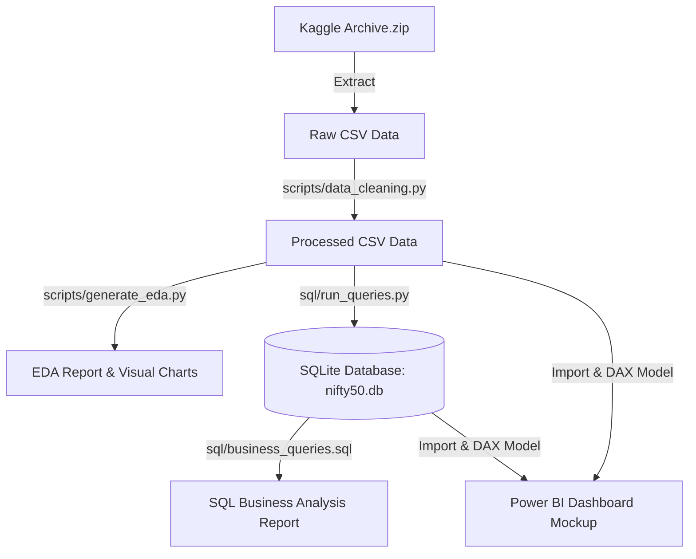
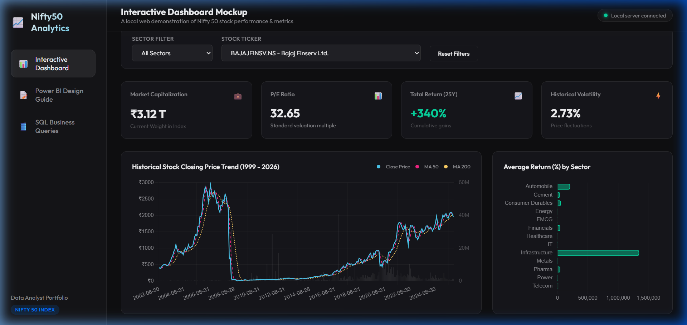

# Nifty 50 Stock Market Data Analysis & Visualization Pipeline
> An end-to-end data engineering and analytics portfolio project examining 25 years (1999–2026) of historical National Stock Exchange (NSE) Nifty 50 index data.

---

## 🚀 Project Overview & Architecture
This project implements a complete industry-grade data pipeline: extracting raw historical financial datasets, cleaning and structuring data using Python, conducting Exploratory Data Analysis (EDA), executing core SQL business analysis queries on a SQLite database, and establishing a professional dashboard architecture for Power BI.



- **Project Setup Script**: [setup_project.py](file:///c:/Stock%20Market/scripts/setup_project.py)
- **Data Cleaning Script**: [data_cleaning.py](file:///c:/Stock%20Market/scripts/data_cleaning.py)
- **Exploratory Data Analysis Script**: [generate_eda.py](file:///c:/Stock%20Market/scripts/generate_eda.py)
- **Database Schema**: [schema.sql](file:///c:/Stock%20Market/sql/schema.sql)
- **Business SQL Queries**: [business_queries.sql](file:///c:/Stock%20Market/sql/business_queries.sql)
- **SQL Driver Script**: [run_queries.py](file:///c:/Stock%20Market/sql/run_queries.py)
- **Interactive Web Dashboard**: [Live Demo](https://DEVEDL.github.io/Stock-Market/powerbi/web/index.html) (or [Local Link](http://localhost:8000/powerbi/web/index.html) when served locally)

---

## 📂 Project Directory Structure
```
c:\Stock Market\
├── data/
│   ├── raw/                 # Original Kaggle CSVs (nifty50_historical_data.csv, etc.)
│   └── processed/           # Cleaned CSVs and SQLite database (nifty50.db)
├── notebooks/
│   ├── eda_summary.md       # Statistical summaries and insights
│   └── images/              # Generated EDA visualizations (.png)
├── scripts/
│   ├── setup_project.py     # Initial folder creation & extraction
│   ├── data_cleaning.py     # Python cleaning, formatting & assertions
│   └── generate_eda.py      # Statistical calculations & matplotlib charts
├── sql/
│   ├── schema.sql           # SQLite database schema and indexes
│   ├── business_queries.sql # Structured analytical business queries
│   ├── run_queries.py       # SQL runner that builds DB and executes queries
│   └── sql_analysis_results.md # Query results formatted as markdown tables
├── powerbi/
│   └── mockups/             # Dashboard screen design mockups
└── README.md                # Premium portfolio documentation
```

---

## 🛠️ Phase 1 & 2: Data Cleaning & Integrity (Python)
Stock market datasets often contain duplicate entries, split/dividend adjustments causing negative price anomalies, mismatched datetime formats, and incomplete indicators.

Our python data cleaning pipeline ([data_cleaning.py](file:///c:/Stock%20Market/scripts/data_cleaning.py)) processes the datasets with the following logic:
1. **Datetime Standardizing**: Parses timezone-aware date strings (e.g., `1999-01-01 00:00:00+05:30`) into standard ISO format (`YYYY-MM-DD`).
2. **Anomaly Sweeping**: Identifies and drops 47 rows with zero or negative close prices (specifically found in early listing history of `ADANIENT.NS`).
3. **High/Low Bound Swapping**: Swap `High` and `Low` prices for 46 rows where technical records listed `High < Low`.
4. **Metric Handling**: Fills null stock split ratios and daily returns with `0.0`, drops the 100% null `PEG_Ratio` column, and enforces numeric validation across rolling indicators (`Volatility_20D`, `MA_50`, `MA_200`).
5. **Re-calculating Summary Stats**: Generates stock summaries directly from daily transaction records, resolving discrepancies in stock starting prices and total returns.

---

## 📈 Phase 3: Exploratory Data Analysis (EDA) Insights
Detailed analytical insights are compiled in [eda_summary.md](file:///c:/Stock%20Market/notebooks/eda_summary.md). The pipeline creates 6 charts in [notebooks/images/](file:///c:/Stock%20Market/notebooks/images/):

### 🌟 Key Findings
- **Growth Leaders (25 Years)**: `ADANIENT.NS` (+4,032,380%) and `EICHERMOT.NS` (+998,972%) are the highest performers in Nifty 50 history.
- **Sector Weighting**: **Financials** is the largest sector in the index by market cap (55.4 Trillion INR, 10 stocks), followed by **IT** (28.3 Trillion INR, 6 stocks).
- **Dividend King**: **Automobile** is the highest dividend-paying sector, with `HEROMOTOCO.NS` (1,613 INR cumulative) and `BAJAJ-AUTO.NS` (1,331 INR cumulative) leading the index.
- **Valuation vs Volatility**: A positive correlation is observed between stock valuation multiples (P/E Ratio) and historical price volatility.

*Check out the generated heatmaps, trend lines, and scatter plots in the [notebooks/images/](file:///c:/Stock%20Market/notebooks/images/) directory!*

---

## 🛢️ Phase 4: SQL Business Analysis
Our SQL engine executes queries to answer complex commercial financial questions. The database resides in [nifty50.db](file:///c:/Stock%20Market/data/processed/nifty50.db). The execution output is stored in [sql_analysis_results.md](file:///c:/Stock%20Market/sql/sql_analysis_results.md).

### 🔍 SQL Highlights
#### Top 5 Stocks by 10-Year Return (2016–2026)
```sql
WITH StartEnd10Y AS (
    SELECT Ticker, Company_Name, Sector,
        (SELECT Close FROM nifty50_historical h2 WHERE h2.Ticker = h1.Ticker AND h2.Date >= '2016-01-30' ORDER BY Date ASC LIMIT 1) as Start_Close,
        (SELECT Close FROM nifty50_historical h2 WHERE h2.Ticker = h1.Ticker AND h2.Date <= '2026-01-30' ORDER BY Date DESC LIMIT 1) as End_Close
    FROM nifty50_historical h1 GROUP BY Ticker
)
SELECT Ticker, Company_Name, Sector, Start_Close, End_Close, ((End_Close - Start_Close) / Start_Close) * 100 AS Return_10Y_Pct
FROM StartEnd10Y WHERE Start_Close IS NOT NULL AND End_Close IS NOT NULL
ORDER BY Return_10Y_Pct DESC LIMIT 5;
```
| Ticker | Company_Name | Sector | Start_Close | End_Close | Return_10Y_Pct |
| :--- | :--- | :--- | :--- | :--- | :--- |
| **ADANIENT.NS** | Adani Enterprises Ltd. | Infrastructure | 39.38 | 2020.40 | **+5030.57%** |
| **BAJFINANCE.NS** | Bajaj Finance Ltd. | Financials | 58.11 | 929.85 | **+1500.25%** |
| **HINDALCO.NS** | Hindalco Industries Ltd. | Metals | 66.72 | 962.60 | **+1342.80%** |
| **JSWSTEEL.NS** | JSW Steel Ltd. | Metals | 94.34 | 1214.40 | **+1187.26%** |
| **TITAN.NS** | Titan Company Ltd. | Consumer Durables | 346.04 | 3977.40 | **+1049.42%** |

#### Top 5 Dividend Yield Sectors (2026)
| Sector | Average Dividend Yield (%) | Number of Companies |
| :--- | :--- | :--- |
| **Power** | 4.19% | 2 |
| **Energy** | 3.99% | 3 |
| **IT** | 3.13% | 6 |
| **Metals** | 2.16% | 4 |
| **FMCG** | 1.95% | 5 |

#### Recent Moving Average Crossovers (50-Day vs 200-Day)
Detects bullish **Golden Crosses** and bearish **Death Crosses** using SQL window functions (`LAG`):
```sql
WITH MA_Prev AS (
    SELECT Date, Ticker, Company_Name, MA_50, MA_200,
        LAG(MA_50, 1) OVER (PARTITION BY Ticker ORDER BY Date) as MA_50_Prev,
        LAG(MA_200, 1) OVER (PARTITION BY Ticker ORDER BY Date) as MA_200_Prev
    FROM nifty50_historical WHERE MA_50 IS NOT NULL AND MA_200 IS NOT NULL
)
SELECT Date, Ticker, Company_Name, MA_50, MA_200,
    CASE 
        WHEN MA_50_Prev <= MA_200_Prev AND MA_50 > MA_200 THEN 'Golden Cross (Bullish)'
        WHEN MA_50_Prev >= MA_200_Prev AND MA_50 < MA_200 THEN 'Death Cross (Bearish)'
    END as Cross_Type
FROM MA_Prev WHERE (MA_50_Prev <= MA_200_Prev AND MA_50 > MA_200) OR (MA_50_Prev >= MA_200_Prev AND MA_50 < MA_200)
ORDER BY Date DESC LIMIT 20;
```

---

## 📊 Phase 5: Power BI Dashboard & Visuals Blueprint
The dashboard architecture is built around a **Star Schema** designed for Power BI modeling, utilizing:
- **Fact Table**: `nifty50_historical` (Daily transaction records)
- **Dimension Tables**: `nifty50_summary` (Company characteristics) and DAX-generated `Calendar` table.

### 📝 Key DAX Formulation: Compound Annual Growth Rate (CAGR)
```dax
CAGR = 
VAR StartPrice = CALCULATE(AVERAGE(nifty50_historical[Close]), FIRSTDATE(nifty50_historical[Date]))
VAR EndPrice = CALCULATE(AVERAGE(nifty50_historical[Close]), LASTDATE(nifty50_historical[Date]))
VAR Days = DATEDIFF(FIRSTDATE(nifty50_historical[Date]), LASTDATE(nifty50_historical[Date]), DAY)
VAR Years = DIVIDE(Days, 365.25, 0)
RETURN IF(StartPrice > 0 && EndPrice > 0 && Years > 0.5, (EndPrice / StartPrice) ^ (1 / Years) - 1, BLANK())
```

### 🖼️ Dashboard Mockup Preview
Designed in a **Glassmorphic Dark Theme** (deep navy backdrop `#121214` and slate gray container card widgets `#1E1E24` with glowing cyan accents):


---

## 🖥️ Interactive Web Dashboard
For immediate portfolio presentation, we provide an **interactive web dashboard** that replicates the Power BI dashboard layout.

🔗 **Live Public Demo**: [https://DEVEDL.github.io/Stock-Market/powerbi/web/index.html](https://DEVEDL.github.io/Stock-Market/powerbi/web/index.html)

🔗 **Local Access**: [http://localhost:8000/powerbi/web/index.html](http://localhost:8000/powerbi/web/index.html) *(Requires running the local server script)*

### How to Publish for Your Followers (GitHub Pages)
Since this dashboard is built using standard HTML, CSS, and JS, you can host it for free using **GitHub Pages**:
1. Push this project folder to a repository on **GitHub**.
2. Go to the repository's **Settings** tab.
3. In the left sidebar, click **Pages** (under the "Code and automation" section).
4. Under **Build and deployment**, set the source to **Deploy from a branch**.
5. Select your main branch (e.g., `main` or `master`) and folder (select `/ (root)`), then click **Save**.
6. GitHub will generate a live URL (usually `https://DEVEDL.github.io/Stock-Market/`).
7. The **Live Public Demo** link above will then be live and accessible to your followers!

Features:
- **Interactive Slicers**: Select Sector and Tickers dynamically.
- **Dynamic KPI Cards**: Updates valuation indicators, volatility levels, and compound return metrics.
- **Interactive Price Chart**: Displays chronological Close prices alongside 50-day and 200-day rolling averages, overlaid on daily trade volumes using **Chart.js**.
- **Interactive Sector Analytics**: Horizontal bar chart reflecting returns dynamically.



---

## 🛠️ Setup & Replication Guide

### Prerequisites
Ensure Python 3.x is installed along with the required libraries:
```bash
pip install pandas numpy matplotlib seaborn
```

### Running the Pipeline End-to-End
Execute the scripts in order from the repository root:

1. **Extract and Setup Folders**:
   ```bash
   python scripts/setup_project.py
   ```
2. **Execute Data Cleaning**:
   ```bash
   python scripts/data_cleaning.py
   ```
3. **Generate EDA & Visualizations**:
   ```bash
   python scripts/generate_eda.py
   ```
4. **Run Database Initialization & SQL Business Queries**:
   ```bash
   python sql/run_queries.py
   ```
5. **Start Local Web Server Dashboard**:
   ```bash
   python scripts/serve_dashboard.py
   ```

*The database will be built at `data/processed/nifty50.db`, all queries will compile into `sql/sql_analysis_results.md`, and the local HTTP server will launch on port `8000`, automatically opening the interactive dashboard webpage in your browser.*

